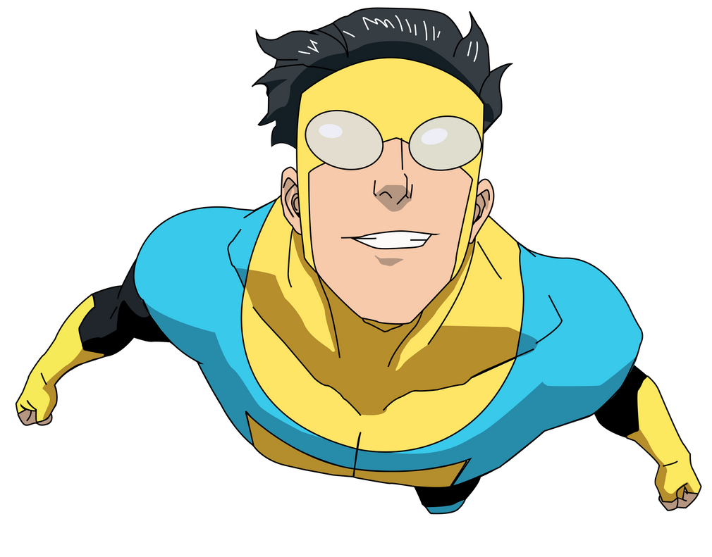

 
<h1> Hi there 👋 </h1>

  

<h2> 🤵 About Me: </h2>

- 🌱 I’m currently a Machine Learningn Engineer at Sercair
- 🔭 I’m currently exploring on Machine Learning and Computer Vision Projects
- 👯 I’m looking to collaborate on Machine Learning and Deep Learning Projects
- 🎯 I’m currently focusing on: Computer Vision and Augmented Reality
- 📚 I have a Bachelors in Computer Engineering from the University of Duzce at Turkey
- 🌟 Main languages: Python
- 🎵 Love metal and rock music

Connect with me on
 	
<a target="_blank" href="https://www.linkedin.com/in/tolgaisk/"
></img></a>
&emsp;
<a target="_blank" href="https://www.kaggle.com/tolgaik"></img></a>
&emsp;
<a target="_blank" href="mailto:tolgaisk10@gmail.com"
></img></a> 

----

## 💻 GitHub Profile Stats

   

  

----

## 🛠️ Skills

#### Languages
&nbsp;
&nbsp;
&nbsp;
&nbsp;

#### Deployment
&nbsp;
&nbsp;
&nbsp;
&nbsp;

#### Database
&nbsp; 
&nbsp;

#### Data Analytics 

&nbsp;
&nbsp;
&nbsp;
&nbsp;
&nbsp;

#### Others
&nbsp;
&nbsp;
&nbsp;
&nbsp;
&nbsp;
